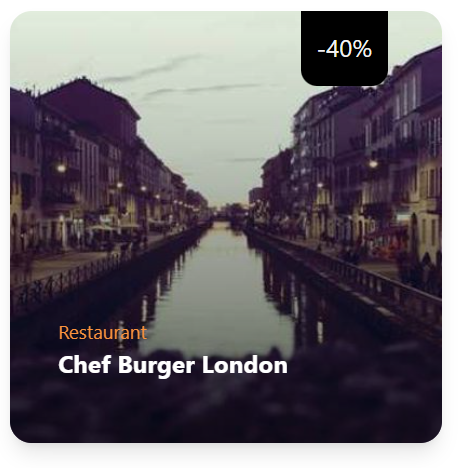

1. ### A simple card with background image and text over it with zoom effect on hover

```html
<div class="group relative max-w-xs overflow-hidden rounded-2xl shadow-lg m-4">
  
  <div
    class="absolute inset-0 flex items-end bg-gradient-to-t from-black/60 to-transparent"
  >
    <div class="p-4 text-white">
      <p class="mb-2 text-xl font-bold">Title</p>
      <p class="">
        Le tempore quia. Excepturi distinctio repellat reprehenderit voluptas,
        nostrum voluptatum ea?
      </p>
    </div>
  </div>
</div>
```

1. image reference :

2. ### Card with discount % at top , zoom(scale effect) on hover linear gradient from left to right

```html
<div class="group relative max-w-xs overflow-hidden rounded-2xl shadow-lg m-4">
  
  <div
    class="w-16 h-14 bg-black absolute right-10 top-0 rounded-b-xl flex items-center justify-center"
  >
    <p class="text-white text-lg">-40%</p>
  </div>
  <div
    class="absolute inset-0 flex items-end bg-gradient-to-r from-black/60 to-transparent"
  >
    <div class="p-4 text-white m-5">
      <p class="text-sm text-orange-400">Restaurant</p>
      <p class="mb-2 text-lg font-bold">Chef Burger London</p>
    </div>
  </div>
</div>
```

2. Image reference : 

3. ### card with image and text below the image

```html
<div class="group m-4 w-40 overflow-hidden rounded-xl bg-gray-200">
  
  <div class="mb-2 ml-2">
    <p class="text-sm">Burgers and Fastfood</p>
    <p class="text-xs text-orange-400">21 resturants</p>
  </div>
</div>
```

3. Image reference :

4. ### card with background image , gradient , zoom , texts and button

```html
<div
  class="group relative m-3 h-[300px] max-w-md overflow-hidden rounded-xl bg-red-200"
>
  <div class="absolute left-16 rounded-b-xl bg-white px-3 py-2 z-10">
    <p class="text-sm font-medium">Earn more with lower Fee</p>
  </div>
  
  <div
    class="absolute inset-0 flex items-end bg-gradient-to-tr from-black to-transparent"
  >
    <div class="m-5  p-4">
      <p class="text-sm text-orange-400">Signup as a Business</p>
      <p class="mb-2 text-3xl font-bold text-white">Partner With US</p>
      <button class="rounded-2xl bg-orange-500 px-5 py-2 text-white font-bold ">
        Get Started
      </button>
    </div>
  </div>
</div>
```

4. Image refrence :
