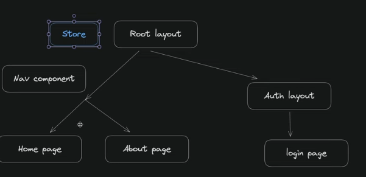

### What is redux ?

--> Redux is a pattern and library for managing and updating application state, using events called "actions

### Why should i use Redux?

- Managing application states in many places
- some use case
  - Adding to-do items
  - user information
  - cart details
  - track and revert to previous states (incorrect cart items)
  - Manage API calls Asynchronously
  - Managing Sessions

## Steps to use Redux

1. Install

2. ### create **app/store.ts** and create empty reducer

**Note**: In Redux, a reducer is a pure function that takes an action and the previous state of the application and returns the new state. such as addto cart , remove from cart

```typescript
import { configureStore } from "@reduxjs/toolkit";
export const store = configureStore({
  reducer: {},
});

export type RootState = ReturnType<typeof store.getState>;
export type AppDispatch = typeof store.dispatch;
```

3. ### Wrap app with Provider

we can use provider according to it uses area , For this we are using provider in whole app



As Redux is client side and should be used only in client side ,In Next js we create **app /StoreProvider** as client and use <Provider> there . Can be done direclty in react.

**3.1 app/StoreProvider.tsx**

```typescript
"use client";

import { store } from "@/lib/Store";
import React, { ReactNode } from "react";
import { Provider } from "react-redux";

const StoreProvider = ({ children }: { children: ReactNode }) => {
  return <Provider store={store}>{children}</Provider>;
};

export default StoreProvider;
```

**3.2 app/layout.tsx**

```typescript
import type { Metadata } from "next";
import { Inter } from "next/font/google";
import "./globals.css";
import NavBar from "@/components/ui/NavBar";
import Footer from "@/components/ui/Footer";
import BottomNavbar from "@/components/ui/BottomNavbar";
import StoreProvider from "./StoreProvider";

const inter = Inter({ subsets: ["latin"] });

export const metadata: Metadata = {
  title: "Create Next App",
  description: "Generated by create next app",
};

export default function RootLayout({
  children,
}: Readonly<{
  children: React.ReactNode;
}>) {
  return (
    <html lang="en">
      <StoreProvider>
        <body className={inter.className}>
          <NavBar />
          // .............
          <Footer />
        </body>
      </StoreProvider>
    </html>
  );
}
```

4. ### Create some folders and files as

**lib/store/features/cart/CartSlice.ts**

```typescript
import { createSlice, PayloadAction } from "@reduxjs/toolkit";

// Define a type for the slice state
export interface CartState {
  items: string[];
}

// Define the initial state using that type
const initialState: CartState = {
  items: [],
};

export const cartSlice = createSlice({
  name: "cart",
  // `createSlice` will infer the state type from the `initialState` argument
  initialState,
  reducers: {
    add: (state, action) => {
      //data passed to add function can be accessed from action.payload
      state.items.push(action.payload);
    },
    remove: (state, action) => {
      state.items = state.items.filter((item) => item !== action.payload);
    },
  },
});

export const { add, remove } = cartSlice.actions;
export default cartSlice.reducer;
```

#### 4.1 update store.ts

```typescript
import { configureStore } from "@reduxjs/toolkit";

import cartReducer from "@/lib/store/features/cart/CartSlice";
//store is a global variable which is bad for next js as it will be rerendered per request.
//so to solve that we wrap it inside another function

export const makeStore = () => {
  return configureStore({
    reducer: {
      cart: cartReducer,
    },
  });
};

export type AppStore = ReturnType<typeof makeStore>;

export type RootState = ReturnType<AppStore["getState"]>;

export type AppDispatch = AppStore["dispatch"];
```

#### 4.2 Create some hooks **lib\store\hooks\index.ts**

Here , we are defining hooks along with their types for typescript

```typescript
import { useDispatch, useSelector, useStore } from "react-redux";
import type { RootState, AppDispatch, AppStore } from "../Store";

// Use throughout your app instead of plain `useDispatch` and `useSelector`
export const useAppDispatch = useDispatch.withTypes<AppDispatch>();
export const useAppSelector = useSelector.withTypes<RootState>();
export const useAppStore = useStore.withTypes<AppStore>();
```

#### 4.3 update StoreProvider.tsx

```typescript
"use client";

import { AppStore, makeStore } from "@/lib/store/Store";
import React, { ReactNode, useRef } from "react";
import { Provider } from "react-redux";

const StoreProvider = ({ children }: { children: ReactNode }) => {
  const storeRef = useRef<AppStore>();

  if (!storeRef.current) {
    storeRef.current = makeStore();

    // add initial state
    // storeRef.current.dispatch(add("testproductid"));
  }
  return <Provider store={storeRef.current}> {children}</Provider>;
};

export default StoreProvider;
```

#### 5. Add onClick() function inside button and
